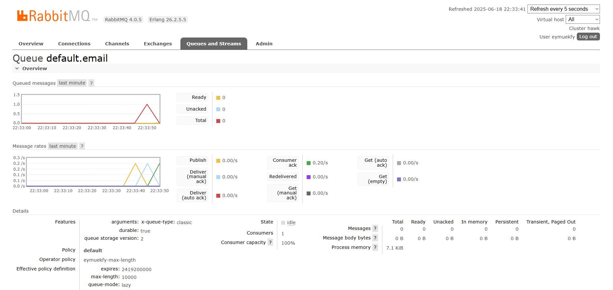
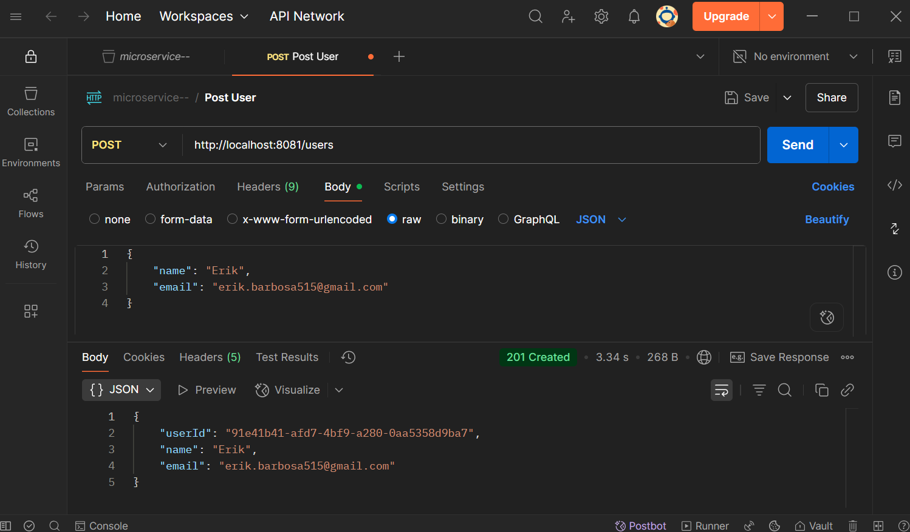

# Microservices: Cadastro de Usuário e Envio de E-mail com Spring Boot e RabbitMQ

Este é um projeto de estudo que implementa uma arquitetura de microsserviços para o cadastro de usuários e o envio de e-mails de boas-vindas. A comunicação entre os serviços é feita de forma assíncrona utilizando RabbitMQ, garantindo desacoplamento e resiliência.


## 📖 Sumário

*   [Visão Geral da Arquitetura](#-visão-geral-da-arquitetura)
*   [Tecnologias Utilizadas](#-tecnologias-utilizadas)
*   [Funcionalidades](#-funcionalidades)
*   [Pré-requisitos](#-pré-requisitos)
*   [Como Configurar e Executar](#-como-configurar-e-executar)
*   [Como Testar a Aplicação](#-como-testar-a-aplicação)
*   [Estrutura do Projeto](#-estrutura-do-projeto)

## 🏗️ Visão Geral da Arquitetura

O projeto é composto por dois microsserviços principais:

1.  **ms-user (Microsserviço de Usuário):**
    *   Responsável por expor uma API REST para o cadastro de novos usuários.
    *   Salva os dados do usuário em seu próprio banco de dados PostgreSQL.
    *   Após o cadastro, publica uma mensagem em uma fila do RabbitMQ com os detalhes para o envio do e-mail.

2.  **ms-email (Microsserviço de E-mail):**
    *   Responsável por "escutar" a fila do RabbitMQ.
    *   Ao receber uma nova mensagem, consome os dados e utiliza um serviço de e-mail (SMTP, neste caso, do Gmail) para enviar um e-mail de boas-vindas.
    *   Salva um registro de cada e-mail enviado (ou que falhou) em seu próprio banco de dados PostgreSQL.

### Fluxo da Aplicação

```
[Cliente API] --(1. POST /users)--> [ms-user] --(2. Salva no BD)--> [DB Usuários]
                                        |
                                        |--(3. Publica Mensagem)--> [RabbitMQ]
                                                                        |
                                                                        |--(4. Consome Mensagem)--> [ms-email] --(5. Envia E-mail)--> [Servidor SMTP]
                                                                                                        |
                                                                                                        |--(6. Salva Log no BD)--> [DB E-mails]
```


## 🚀 Tecnologias Utilizadas

*   **Linguagem:** Java 17
*   **Framework:** Spring Boot 3
*   **Banco de Dados:** PostgreSQL
*   **Mensageria:** CloudAMQP -> RabbitMQ
*   **Comunicação:** API REST
*   **Dependências Principais:**
    *   Spring Web
    *   Spring Data JPA
    *   Spring for RabbitMQ
    *   Spring Boot Validation
    *   Spring Mail Sender
    *   PostgreSQL Driver

## ✨ Funcionalidades

*   ✅ **Cadastro de Usuário:** Endpoint `POST /users` para criar um novo usuário.
*   ✅ **Validação de Dados:** Validação de campos obrigatórios (`@NotBlank`) e formato de e-mail (`@Email`).
*   ✅ **Comunicação Assíncrona:** Envio de eventos para o RabbitMQ após o cadastro bem-sucedido.
*   ✅ **Envio de E-mail:** Serviço de envio de e-mails transacionais de boas-vindas.
*   ✅ **Persistência de Dados:** Cada microsserviço gerencia seu próprio banco de dados, seguindo o padrão *Database per Service*.
*   ✅ **Log de E-mails:** O `ms-email` armazena um histórico dos e-mails enviados e seu status (`SENT` ou `ERROR`).

## 📋 Pré-requisitos

Antes de começar, você precisará ter as seguintes ferramentas instaladas em seu ambiente:

*   JDK 17 ou superior
*   Maven ou Gradle
*   PostgreSQL
*   Docker (opcional, para rodar o PostgreSQL e o RabbitMQ) ou uma instância do RabbitMQ (como o CloudAMQP, que está configurado no projeto)
*   Uma IDE de sua preferência (IntelliJ IDEA, VSCode, Eclipse)
*   Um cliente de API como o Postman ou Insomnia

## ⚙️ Como Configurar e Executar

Siga os passos abaixo para rodar a aplicação localmente.

### 1. Clone o Repositório

```bash
git clone <url-do-seu-repositorio>
cd <nome-da-pasta>
```

### 2. Configure os Bancos de Dados

Você precisa criar dois bancos de dados no seu PostgreSQL:

*   `ms-user`
*   `ms-email`


### 3. Configure o RabbitMQ

O projeto está configurado para usar uma instância do CloudAMQP. A fila `default.email` será criada automaticamente pelo `ms-email` ao iniciar, pois a propriedade `durable` está como `true`.



### 4. Configure o Serviço de E-mail (IMPORTANTE!)

O `ms-email` usa uma conta do Gmail para enviar e-mails.


Para usar o Gmail, você precisa:
1.  Ativar a verificação em duas etapas na sua conta Google.
2.  Gerar uma **"Senha de App"** (App Password). [Saiba como aqui](https://support.google.com/accounts/answer/185833).

Depois, atualize o arquivo `application.properties` do **ms-email** com suas credenciais:

```properties
# src/main/resources/application.properties (do ms-email)

# ... outras propriedades

spring.mail.host=smtp.gmail.com
spring.mail.port=587
spring.mail.username=seu-email@gmail.com # <-- TROCAR AQUI
spring.mail.password=sua-senha-de-app # <-- TROCAR AQUI (senha de 16 dígitos sem espaços)
spring.mail.properties.mail.smtp.auth=true
spring.mail.properties.mail.smtp.starttls.enable=true
```

### 5. Execute os Microsserviços

Você precisa iniciar os dois serviços. Abra dois terminais ou use a sua IDE.

*   **Para iniciar o `ms-user` (porta 8081):**
    Navegue até a pasta raiz do `ms-user` e execute:
    ```bash
    mvn spring-boot:run
    ```

*   **Para iniciar o `ms-email` (porta 8082):**
    Navegue até a pasta raiz do `ms-email` e execute:
    ```bash
    mvn spring-boot:run
    ```

## ✅ Como Testar a Aplicação

Com os dois microsserviços rodando, use o Postman (ou similar) para enviar uma requisição de cadastro.

1.  **Método:** `POST`
2.  **URL:** `http://localhost:8081/users`
3.  **Headers:** `Content-Type: application/json`
4.  **Body (raw, JSON):**

```json
{
    "name": "Seu Nome",
    "email": "seu-email-de-destino@exemplo.com"
}
```



### Resultados Esperados

1.  **Resposta da API:** Você receberá uma resposta `201 Created` com os dados do usuário salvo no banco, incluindo o `userId` gerado.

2.  **Recebimento do E-mail:** Em alguns segundos, você deverá receber um e-mail de boas-vindas no endereço que informou no JSON.

3.  **Verificação nos Bancos de Dados:**
    *   Consulte a tabela `tb_users` no banco `ms-user`. Um novo registro de usuário deve estar lá.
    *   Consulte a tabela `tb_emails` no banco `ms-email`. Um novo registro de log de e-mail deve estar lá com `statusEmail = 'SENT'`.

## 📂 Estrutura do Projeto

A estrutura de pacotes para ambos os microsserviços segue as melhores práticas do Spring Boot, separando as responsabilidades:

```
com.ms.user
├── configs      // Configurações (ex: RabbitMQ)
├── controller   // Controladores REST
├── dtos         // Data Transfer Objects
├── models       // Entidades JPA
├── producers    // Classes que publicam mensagens no RabbitMQ
├── repositories // Repositórios Spring Data JPA
└── services     // Lógica de negócio

com.ms.email
├── configs      // Configurações (ex: RabbitMQ)
├── consumers    // Classes que consomem mensagens do RabbitMQ
├── dtos         // Data Transfer Objects
├── enums        // Enumerações (ex: StatusEmail)
├── models       // Entidades JPA
├── repositories // Repositórios Spring Data JPA
└── services     // Lógica de negócio
```